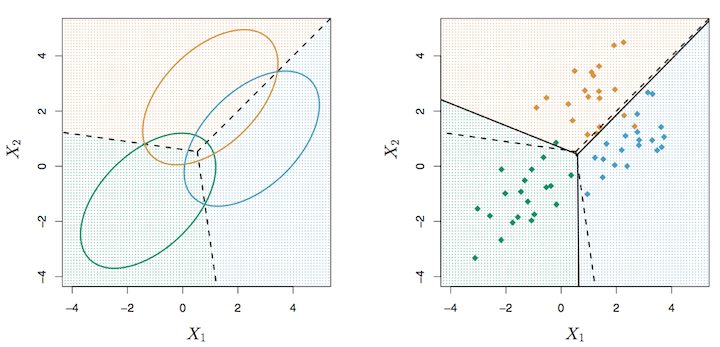
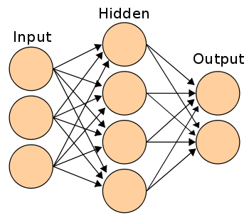

$\DeclareMathOperator*{\argmin}{arg\,min}$
$\DeclareMathOperator*{\logit}{\text{logit}}$

```{r set-seed, echo=FALSE}
set.seed(20141017)
```


## SLG Logistics

Let's thank Brian Gaines, Josh Day, and Will Burton for their
great talks on Regularization & Penalization in Regression!

Reminder: Slides, code, videos available on [Justin Post's website](http://www4.stat.ncsu.edu/~post/reading/index).

Today: First of our three-part classification miniseries.

On the horizon:  

*  Oct. 24: Suchit Mehrotra -- Bayesian Classification Methods 
*  Oct. 31: TBD -- TBD

## Outline

1. Why Classification?
2. Notation
3. The Two Cultures
4. Data Models
5. Algorithmic Models
6. Summary


# Why Classification?

## We're Born to Classify!


## Examples of Supervised Classification

- Automatic Speech Recognition
    - Siri

- Natural Language Processing
    - Google Translate
    - Part-of-speech tagging and syntactic parsing 

- Image Classification
    - Facial recognition
    - Traffic sign identification in self-driving cars
    - Brain tumor diagnosis

- Consumer Analysis
    - Demographic analysis
    - "Customers who bought this item also bought..."

# Notation

## Notation ##

- ${y}_i$: output or response variable (categorical)
    - $i = 1,...,n$
- $x_{ij}$: input, predictor, or feature variable
    - $j = 1,...,p$

Matrix notation  

$\pmb{y} = \begin{pmatrix} y_1 \\ y_2 \\ \vdots \\ y_n \end{pmatrix} $  and 
$\quad \pmb{X} = 
  \begin{pmatrix}
    \pmb{x_1}^T \\
    \pmb{x_2}^T \\
    \vdots \\
    \pmb{x_n}^T
  \end{pmatrix} = 
  \begin{pmatrix} 
    x_{11} & x_{12} & \cdots & x_{1p} \\ 
    x_{21} & x_{22} & \cdots & x_{2p} \\ 
    \vdots & \vdots & \cdots & \vdots \\ 
    x_{n1} & x_{n2} & \cdots & x_{np} 
  \end{pmatrix}$ 
  
## Classes

Let classes be indexed by $k=1,\ldots,K$.

If $K=2$, then $Y$ is binary taking values $\{0, 1\}$.

Otherwise, if $K>2$, then $Y$ takes values $\{1,2,\ldots,K\}$.

# The Two Cultures

## Statistical Modeling: The Two Cultures | Breiman (2001)

### Data Modeling


### Algorithmic Modeling


# Data Models

## OLS Regression

Simple idea: Model $P(Y = 1\,|\,\pmb{x}) = \pmb{x}^T\pmb{\beta} + \beta_0$

```{r cancer-data, echo=FALSE}
cancer <- read.csv("data/breast-cancer-wisconsin.csv")
colnames(cancer) <- c("id", "thickness", "unif.size", "unif.shape", "adhesion", "cell.size",
                      "bare.nuclei", "bland.chromatin", "normal.nucleoli", "mitoses", "malignant")
cancer$malignant <- ifelse(cancer$malignant == 4, 1, 0)
```

```{r cancer-ols, fig.height=3}
library(ggplot2)
ggplot(cancer, aes(x = thickness, y = malignant)) + 
    stat_smooth(method = "lm", se=FALSE) + geom_point(size = 3, alpha = 0.1)
```

## OLS Regression

### Pros:

- Your mother still loves you.

### Cons:

- Predicts probabilities $<0$ and $>1$
- If $K > 2$, the response $\pmb{Y}$ is difficult to define appropriately, if at all.

Surely we can do better.

## Logistic Regression

### Solution:
Do not model the probabilities linearly! Instead, use a function that is bounded between 0 and 1 like the _logistic_ function:

$P(Y = 1\,|\,\pmb{x}) = \frac{\exp(\pmb{x}^T\pmb{\beta} + \beta_0)}{1 + \exp(\pmb{x}^T\pmb{\beta} + \beta_0)} \implies \log\left(\frac{P(Y = 1\,|\,\pmb{x})}{1 - P(Y = 1\,|\,\pmb{x})}\right) = \pmb{x}^T\pmb{\beta} + \beta_0$  

- $\frac{\exp(\pmb{x}^T\pmb{\beta} + \beta_0)}{1 + \exp(\pmb{x}^T\pmb{\beta} + \beta_0)}$ is the _logistic_ function applied to our data $\pmb{x}$; hence, _logistic_ regression.
- $\log\left(\frac{p}{1-p}\right)$ is called the _log-odds_ or _logit_ of $p$.
- The _logit_ is linear in $\pmb{X}$, making this a _linear classifier_.

## Logistic Regression

```{r cancer-logistic}
ggplot(cancer, aes(x = thickness, y = malignant)) + 
    stat_smooth(method = "glm", family = "binomial", se = FALSE) + 
    geom_point(size = 3, alpha = 0.1)
```


## Logistic Regression

### Pros:

- Familiar framework: regression!
- Allows for statistical inference on the parameters.

### Cons:

- Extensions to $K>2$ exist but are not widely used.

## Linear Discriminant Analysis (LDA)

In LR we directly model $P(Y = k\,|\,\pmb{X} = \pmb{x})$ via the logistic function.  

In LDA we model $P(\pmb{X} = \pmb{x}\,|\,Y = k)$ and Bayes' Theorem tells us that

$$
P(Y = k\,|\,\pmb{X} = \pmb{x}) = \frac{P(\pmb{X} = \pmb{x}\,|\,Y = k)P(Y = k)}{\sum_{l=1}^K P(\pmb{X} = \pmb{x}\,|\,Y = l)P(Y = l)}
$$
where $\sum_{k=1}^K P(Y=k) = 1$.

## Linear Discriminant Analysis (LDA)

LDA places two primary assumptions on $P(\pmb{X} = \pmb{x}\,|\,Y = k)$:

1. Conditional on $Y = k$, $\pmb{X}$ follows a $p$-dimensional Gaussian distribution with mean $\pmb{\mu_k}$ and covariance matrix $\pmb{\Sigma_k}$.
2. All classes share a common covariance matrix. i.e., $\pmb{\Sigma_k} = \pmb{\Sigma}$ for $k=1,\ldots,K$.

Then the _class density_ of $\pmb{X}$ given $Y = k$ is 
$$ P(\pmb{X} = \pmb{x}\,|\,Y = k) = (2\pi)^{-p/2}|\pmb{\Sigma}|^{-1/2}\exp\left\{-\frac{1}{2}(\pmb{x} - \pmb{\mu_k})^T\pmb{\Sigma}^{-1}(\pmb{x} - \pmb{\mu_k})\right\}$$

## Linear Discriminant Analysis (LDA)

Consider the _log-ratio_ between classes $k$ and $l$,
$$
\log\frac{P(Y=k\,|\,\pmb{X} = \pmb{x})}{P(Y = l\,|\,\pmb{X} = \pmb{x})} = \log\frac{P(\pmb{X} = \pmb{x}\,|\,Y = k)}{P(\pmb{X} = \pmb{x}\,|\,Y = l)} + \log\frac{P(Y=k)}{P(Y=l)} \\
= \pmb{x}^T\pmb{\Sigma}^{-1}(\pmb{\mu_k} - \pmb{\mu_l}) - \frac{1}{2}(\pmb{\mu_k} - \pmb{\mu_l})^T\pmb{\Sigma}^{-1}(\pmb{\mu_k} - \pmb{\mu_l}) + \log\frac{P(Y=k)}{P(Y=l)}.
$$

(Notice the normalizing constant $(2\pi)^{-p/2}|\pmb{\Sigma}|^{-1/2}$ and quadratic term $-\frac{1}{2}\pmb{x}^T\pmb{\Sigma}^{-1}\pmb{x}$ cancel due to the common covariance assumption.)

If this ratio is positive, $\pmb{X}$ is more likely to have arisen from class $k$ than $l$.

## Linear Discriminant Analysis (LDA)

Over all classes $k=1,\ldots,K,$ the data $\pmb{x}$ is most likely to have arisen from the class $k$ maximizing 
$$
\delta_k(\pmb{x}) = \pmb{x}^T\pmb{\Sigma}^{-1}\pmb{\mu_k} - \frac{1}{2}\pmb{\mu_k}^T\pmb{\Sigma}^{-1}\pmb{\mu_k} + \log P(Y=k).
$$

$\delta_k(\pmb{x})$ is linear in $\pmb{x}$, hence it is a linear classifier (like LR).

## Linear Discriminant Analysis (LDA)



- Dashed Lines -- optimal Bayes decision boundary
- Solid Lines -- decision boundary estimated by LDA

(image from _An Introduction to Statistical Learning_, pg. 143)

## Linear Discriminant Analysis (LDA)

### Pros:

- Easily handles arbitrary number of classes $K$.
- Provides added stability of parameter estimates via priors on class size

### Cons:

- Gaussian assumption may not be appropriate.

## Green Eggs and Spam

```{r spam-data}
spambase <- read.csv("data/spambase.csv")
head(spambase)[1:3, c(58, 1:10)]
tail(spambase)[-(1:3), c(58, 1:10)]
```

## Green Eggs and Spam

```{r spam-test-train}
# Some variables...
# word_freq_make
# word_freq_address
# word_freq_all
# word_freq_3d
# word_freq_our
# word_freq_over
# word_freq_remove
# word_freq_internet

# Make training and testing sets
test <- runif(nrow(spambase)) < 0.2
spam.test  <- spambase[test, ]
spam.train <- spambase[!test, ]
```

## Green Eggs and Spam

### Logistic Regression
```{r spam-logistic, warning=FALSE}
fit <- glm(X1 ~ ., data = spam.train, family = "binomial")
pred <- predict(fit, newdata = spam.test, type = "response")
(tab <- table(pred = as.numeric(pred > 0.5), true = spam.test[, 58]))
sum(diag(tab))/sum(tab)  # classification rate
```

## Green Eggs and Spam

### Linear Discriminant Analysis

```{r spam-lda, warning=FALSE}
library(MASS)
fit <- lda(X1 ~ ., data = spam.train)
pred <- predict(fit, spam.test)$class
(tab <- table(pred = pred, true = spam.test[, 58]))
sum(diag(tab))/sum(tab)  # classification rate
```

## Which do I use?

### Logistic Regression 

- Response $Y$ is binary ($K=2$)
- Used when the Gaussian assumption of LDA is not valid

### Linear Discriminant Analysis

- Response $Y$ is not binary ($K > 2$)
- More powerful than LR if the Gaussian assumption is valid
- Can incorporate prior information on relative size of classes through $P(Y = k)$

# Algorithmic Models

## $k$-Nearest Neighbors

Here, $k$ references number of points nearby, _NOT_ classes.

The class membership of any unclassified object is determined by a "majority vote" from the classes of its $k$ nearest neighbors.  (Ties are typically broken at random.)

Of course, the distance metric applied to any two data points $\pmb{x_1}$ and $\pmb{x_2}$ defines which neighbors are nearest.

- Euclidean $\quad D(\pmb{x_1},\pmb{x_2}) = \left\{\sum_{j=1}^p (x_{1j} - x_{2j})^2\right\}^{1/2}$
- Manhattan $\quad D(\pmb{x_1},\pmb{x_2}) = \sum_{j=1}^p |x_{1j} - x_{2j}|$
- Chebychev $\quad D(\pmb{x_1},\pmb{x_2}) = \max_{j=1}^p |x_{1j} - x_{2j}|$

## $k$-Nearest Neighbors

```{r 1nn, message=FALSE, warning=FALSE, echo=FALSE}
library(ElemStatLearn) # examples from The Elements of Statistical Learning
library(class) # knn
# load objects from mixture.example
x <- mixture.example$x
g <- mixture.example$y
xnew <- mixture.example$xnew
px1 <- mixture.example$px1
px2 <- mixture.example$px2

run_knn_and_plot <- function(k, main = "") {
    # run KNN
    pred <- knn(x, xnew, g, k = k, prob=TRUE)
    prob <- attr(pred, "prob")
    prob <- ifelse(pred == "1", prob, 1 - prob)
    prob <- matrix(prob, length(px1), length(px2))
    # plot results
    par(mar = rep(2, 4))  # adjust plot window
    contour(px1, px2, prob, levels = 0.5, labels = "", xlab = "", ylab = "", 
            main = main, axes=FALSE)
    points(x, col=ifelse(g == 1, "coral", "cornflowerblue"))
    gd <- expand.grid(x = px1, y = px2)
    points(gd, pch=".", cex=1.2, col = ifelse(prob > 0.5, "coral", "cornflowerblue"))
    box()
}

run_knn_and_plot(k = 1, main = "1-nearest neighbor")
```

## $k$-Nearest Neighbors

```{r 5nn, echo=FALSE}
run_knn_and_plot(k = 5, main = "5-nearest neighbors")
```

## $k$-Nearest Neighbors

```{r 15nn, echo=FALSE}
run_knn_and_plot(k = 15, main = "15-nearest neighbors")
```

## $k$-Nearest Neighbors

### Green Eggs and Spam

```{r spam-knn}
library(class)
pred <- knn(train = spam.train[, -58], test = spam.test[, -58], 
            cl = spam.train[, 58])
(tab <- table(pred = pred, true = spam.test[, 58]))
sum(diag(tab))/sum(tab)  # classification rate
```


## $k$-Nearest Neighbors

### Pros

- Intuitive
- Non-linear classifier
- Robust against noisy data with larger $k$
- Most appropriate for large $n$, small $p$ problems

### Cons

- Large storage requirements
- Curse of Dimensionality -- distances may be adversely affected by irrelevant features
- Sensitive to choice of distance metric
- Best way to select $k$ is through expensive cross-validation.

## Perceptron Algorithm 

Assume training data are linearly separable for $K=2$ classes.

That is, it is possible to achieve 0 misclassification error with a linear decision boundary (or a hyperplane in higher dimensions).

Suppose $\pmb{Y} \in \{-1, 1\}$ and define the linear separator by $\pmb{x}^T\pmb{\beta} + \beta_0$.  

A response $y_i = 1$ is misclassified if $\pmb{x_i}^T\pmb{\beta} + \beta_0 < 0$.  

Conversely, $y_i = -1$ is misclassified if $\pmb{x_i}^T\pmb{\beta} + \beta_0 \geq 0$.

## Perceptron Algorithm

Rosenblatt's Idea: Minimize $D(\pmb{\beta}, \beta_0) = - \sum_{i\in\mathcal{M}} y_i(\pmb{x_i}^T\pmb{\beta} + \beta_0)$ where $\mathcal{M}$ is the set of misclassified points.

This is guaranteed to converge to a solution in a finite number of steps by the Perceptron Convergence Theorem (Rosenblatt, 1962).

## Perceptron Algorithm

Pros:

- Perceptron is a cool word
- Amenable to online-learning (data are processed element-by-element)

Cons:

- Convergence may be slow
- Solution is not unique
- If not linearly separable, algorithm will not converge
- __Linear separability is rare!__

## Perceptron Algorithm | Rosenblatt with the Mark I Perceptron (1960)


(image from _Neurocomputing_)

## Perceptron Algorithm

"The Navy revealed the embryo of an electronic computer today that it expects will be able to walk, talk, see, write, reproduce itself and be conscious of its existence. 

Later perceptrons will be able to recognize people and call out their names and instantly translate speech in one language to speech and writing in another language, it was predicted."

-- _The New York Times_, 1958 (Olazaran, 1996)


## Perceptron Algorithm

In their book _Perceptron_, Minsky and Papert (1969) show that the perceptron fails to classify points produced by a simple XOR function.

This book besmirched perceptron research through the 1970s and 1980s.

Rumelhart et al. (1986) showed multi-layered perceptrons overcome this limitation and more. 

Like any good comeback story, perceptrons were rebranded as...


## Artificial Neural Networks



Each unit is a single perceptron.

Really rich topic, better suited for future talks.

Especially relevant today as it forms the basis for _Deep Learning_.

## Decision Trees

Trees are grown by _recursive binary splitting_: 

1. Find the variable (quantitative or qualitative) which "best" splits the data into two nodes
2. For each new group, repeat step 1.

### Terminology

--------|--------
Root    | Very first node of the tree
Branch  | Path down which data are split leading to a new node
Leaf    | Terminal node (no further classification)
Pruning | Act of removing least beneficial branches and leaves after tree is grown to reduce complexity, prevent overfitting

## Decision Trees

Let $\hat{p}_{mk}$ denote the proportion of observations of class $k$ at node $m$ and let $k(m) = \arg\max_k \hat{p}_{mk}$.

The "best" split is one that minimizes _node impurity_ determined by one of several possible metrics:

- Misclassification Rate $\quad 1 - \hat{p}_{mk(m)}$
- Gini index $\quad \sum_{k=1}^K \hat{p}_{mk}(1-\hat{p}_{mk})$
- Cross-entropy or deviance $\quad -\sum_{k=1}^K \hat{p}_{mk}\log\hat{p}_{mk}$


## Decision Trees

### Node Impurity for $K=2$


(image from _The Elements of Statistical Learning_, pg. 309)

## Decision Trees

```{r fungi-data}
fungi <- read.csv("data/agaricus-lepiota.csv", header = FALSE)

# 1. class: e=edible,p=poisonous
# 2. cap-shape: bell=b,conical=c,convex=x,flat=f,
#               knobbed=k,sunken=s
# 3. cap-surface: fibrous=f,grooves=g,scaly=y,smooth=s
# 4. cap-color: brown=n,buff=b,cinnamon=c,gray=g,green=r,
#               pink=p,purple=u,red=e,white=w,yellow=y
# 4. bruises?: bruises=t,no=f
# 5. odor: almond=a,anise=l,creosote=c,fishy=y,foul=f,
#          musty=m,none=n,pungent=p,spicy=s
# 6. gill-attachment: attached=a,descending=d,free=f,notched=n
# 7. gill-spacing: close=c,crowded=w,distant=d
# 8. gill-size: broad=b,narrow=n
# ...
```

```{r fungi-colnames, echo=FALSE}
colnames(fungi) <- c("class", "cap.shape", "cap.surface", "cap.color", 
                     "bruises", "odor", "gill.attachment", 
                     "gill.spacing", "gill.size", "gill.color",
                     "stalk.shape", "stalk.root", 
                     "stalk.surface.above.ring", 
                     "stalk.surface.below.ring", 
                     "stalk.color.above.ring", 
                     "stalk.color.below.ring",
                     "veil.type", "veil.color", "ring.number", 
                     "ring.type", "spore.print.color",
                     "population", "habitat")
```

## Decision Trees

```{r fungi-tree}
library(tree)
mushroom <- tree(class ~ ., data = fungi, split = "deviance")
summary(mushroom)
```

## Decision Trees

```{r fungi-tree-info}
mushroom
```

## Decision Trees
```{r fungi-tree-plot, fig.height=5}
plot(mushroom); text(mushroom)
```

## Decision Trees

### Pros:

- Intuitive
- _Super_ interpretable
- Handles both quantitative and qualitative variables simultaneously, therefore requiring minimal data pre-processing

### Cons:

- Does not account for dependence between variables within each class
- High variance -- trees can vary a great deal between data sets

## Decision Trees | Ensemble Methods -- Bagging and Random Forests

- Intended to lower variance by considering a collection of many trees rather than a single tree.
- Interpretability is sacrificed in favor of improved prediction performance.

### Bagging (Bootstrap Aggregating)

- Take $B$ bootstrap samples from the data
- For each sample, grow a decision tree with no pruning
- Classify new observations by "majority vote" across $B$ decision trees

## Decision Trees | Ensemble Methods -- Bagging and Random Forests

### Random Forests

Attempts to alleviate correlation between trees present in the bagging case.

- Take $B$ bootstrap samples from the data
- For each sample, take random subset of predictors of size $m \approx \sqrt{p}$ and grow a decision tree with no pruning _only on the_ $m$  _predictors_
- Classify new observations by "majority vote" across $B$ decision trees


## Support Vector Machines

Very popular in the 1990s, and still today.

Discussed next month beginning with Jami Jackson's talk on November 7.


## Summary

- There is no shortage of supervised classification methods

- Important choice between data modeling and algorithmic modeling:
    - The former allows for inference to be made on the parameters
    - The latter often yields better predictions
    
- Sometimes the best option is to run multiple classifiers (if computation is not a major issue)

_The great masters do not take any Model quite so seriously as the rest of us. They know that it is, after all, only a model, possibly replaceable._

-- C.S. Lewis, in _The Discarded Image_

# Thank You!

## References

Breiman, L. (2001). Statistical modeling: The two cultures (with comments and a rejoinder by the author). _Statistical Science_, 16(3), 199-231.

Hastie, T., Friedman, J., & Tibshirani, R. (2009). _The Elements of Statistical Learning_. New York: Springer.

James, G., Witten, D., Hastie, T., & Tibshirani, R. (2013). _An Introduction to Statistical Learning_. New York: Springer.

Rosenblatt, F. (1962): _Principles of neurodynamics; perceptrons and the theory of brain mechanisms_. Washington: Spartan Books.

## References

Arvin Calspan Advanced Technology Center; Hecht-Nielsen, R. (1990). _Neurocomputing_. Massachusetts: Addison-Wesley

Olazaran, M. (1996). A sociological study of the official history of the perceptrons controversy. _Social Studies of Science_, 26(3), 611-659.

Minsky, S. & Papert, M. (1969). _Perceptrons: An introduction to computational geometry. Expanded Edition_.

Rumelhart, D., McClelland, J., and the PDP Research Group (1986). _Parallel Distributed Processing: Explorations in the Microstructure of Cognition. Vol.1 and 2_, Massachusetts: MIT Press.


